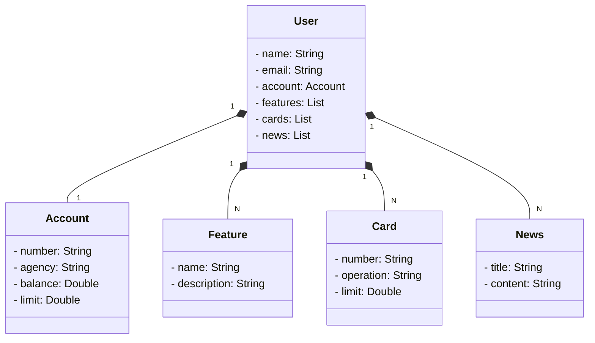

# Getting Started

# Simple Application with spring web and data jpa, railway for publishing.

##Diagrama de Classes:

### Reference Documentation

For further reference, please consider the following sections:

* [Official Gradle documentation](https://docs.gradle.org)
* [Spring Boot Gradle Plugin Reference Guide](https://docs.spring.io/spring-boot/3.3.7/gradle-plugin)
* [Create an OCI image](https://docs.spring.io/spring-boot/3.3.7/gradle-plugin/packaging-oci-image.html)
* [Spring Data JPA](https://docs.spring.io/spring-boot/3.3.7/reference/data/sql.html#data.sql.jpa-and-spring-data)
* [Spring Web](https://docs.spring.io/spring-boot/3.3.7/reference/web/servlet.html)

### Guides

The following guides illustrate how to use some features concretely:

* [Accessing Data with JPA](https://spring.io/guides/gs/accessing-data-jpa/)
* [Building a RESTful Web Service](https://spring.io/guides/gs/rest-service/)
* [Serving Web Content with Spring MVC](https://spring.io/guides/gs/serving-web-content/)
* [Building REST services with Spring](https://spring.io/guides/tutorials/rest/)

### Additional Links

These additional references should also help you:
* [Gradle Build Scans – insights for your project's build](https://scans.gradle.com#gradle)

### print da aplicação implantada no railway:

### acesso púlbico a aplicação:
* openapi-doc: <https://dio-spring-railway-application-production.up.railway.app/swagger-ui/index.html#/>

